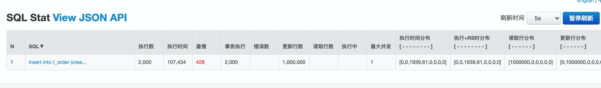

## work01

1. 使用`PreparedStatement`

* 每次1000条就commit: 原生JDBC操作， 使用insert into values 多个，这个是最快的，插入 t_order 100W数据大致26秒，
* 一次性100W commit， 大致23秒
* 每次1W commit， 大致28秒
* 单次1W + 批处理，大致28秒
* 单次commit限制跟这个参数有关，select @@max_allowed_packet，默认安装的mysql8.0 默认值是64M，
```
 String sql = "insert into t_order (order_id, merchant_id, user_id, user_name, money, dicount_money, deliver_fee, create_time)" +
                        " values " + values(orders);
```

2. 使用JPA批量插入，每次1000，flush缓存，使用Druid SQL监控，导致107秒完成


```
spring:
  jpa:
    properties:
      hibernate:
        jdbc:
          batch_size: 1000
```

3. 使用`PreparedStatement` + 批处理耗时，单次1000，这个比较慢，耗时 107 秒, 跟JPA批量插入差不多


```
String sql = "insert into t_order (order_id, merchant_id, user_id, user_name, money, dicount_money, deliver_fee, create_time) values (?, ?, ?, ?,?, ?, ?, ?)";


PreparedStatement ps = conn.prepareStatement(sql);


 for (int i = 0; i < list.size(); i ++) {

     TOrder order = list.get(i);

     ps.setLong(1, order.getOrderId());
     ps.setLong(2, order.getMerchantId());
     ps.setLong(3, order.getUserId());
     ps.setString(4, order.getUserName());
     ps.setDouble(5, order.getMoney());
     ps.setDouble(6, order.getDicountMoney());
     ps.setDouble(7, order.getDeliverFee());
     ps.setLong(8, order.getCreateTime());

    ps.addBatch();

    //每1000次提交一次
    if(i%1000==0){//可以设置不同的大小；如50，100，500，1000等等
        ps.executeBatch();
        conn.commit();
        ps.clearBatch();
    }

}
```

4. TODO 1. 使用Mybatis插入  2. 多张关联表一起插入


5. 使用的表结构如下
```
/*==============================================================*/
/* Table: "order"                                               */
/*==============================================================*/
create table t_order
(
  order_id             bigint not null comment '流水号',
  merchant_id          bigint not null comment '商户ID',
  user_id              bigint not null comment '用户ID',
  user_name            varchar(50) not null comment '用户名称',
  money                decimal(16,4) comment '金额',
  dicount_money        decimal(16,4) comment '优惠金额',
  deliver_fee          decimal(16,4) comment '运费',
  create_time          bigint not null comment '创建时间',
  primary key (order_id)
)COMMENT='订单'
ENGINE = InnoDB
DEFAULT CHARSET = utf8mb4;
```

## work02 动态数据源1.0版本

>基于AbstractRoutingDataSource，ThreadLocal实现多租户动态数据源，关键代码如下

```
public class DynamicDataSource extends AbstractRoutingDataSource {

    private static final Logger log = LoggerFactory.getLogger(DynamicDataSource.class);

    @Autowired
    private ApplicationContext applicationContext;

    @Lazy
    @Autowired
    private DynamicDataSourceSummoner summoner;

    @Lazy
    @Autowired
    private TenantDbService tenantDbService;

    private static boolean loaded = false;

    @PostConstruct
    public void init(){
        // 防止重复执行
        if (!loaded) {
            loaded = true;
            try {
                summoner.registerDynamicDataSources();
            } catch (Exception e) {

                log.error("数据源初始化失败, Exception:", e);
            }
        }
    }

    @Override
    protected String determineCurrentLookupKey() {

        TenantDbConfig tenantDbConfig = getTenantDbConfig();

        String beanKey = DataSourceUtil.getDataSourceBeanId(tenantDbConfig.getName());

        return DataSourceUtil.getDataSourceBeanId(beanKey);
    }

    @Override
    protected DataSource determineTargetDataSource() {


        TenantDbConfig tenantDbConfig = getTenantDbConfig();

        String tenantId = tenantDbConfig.getTenantId();

        String beanKey = DataSourceUtil.getDataSourceBeanId(tenantDbConfig.getName());

        if (!StringUtils.hasText(tenantId) || applicationContext.containsBean(beanKey)) {
            return super.determineTargetDataSource();
        }
        if (tenantDbService.exist(tenantId)) {
            summoner.registerDynamicDataSources();
        }
        return super.determineTargetDataSource();
    }

    private TenantDbConfig getTenantDbConfig() {
        String tenantId = AppContextHolder.getSourceKey();
        Boolean readOnly = AppContextHolder.getReadOnly();

        List<TenantDbConfig> tenantDbConfigs = tenantDbService.listByTenantId(tenantId, readOnly);

        Assert.notEmpty(tenantDbConfigs, "TenantDbConfig not empty");

        TenantDbConfig tenantDbConfig = null;

        if (readOnly) {
            //简易负载均衡 - 轮询实现
            tenantDbConfig =  RoundRobin.getDataSource(tenantDbConfigs);
        }else {

            if (tenantDbConfigs.size() > 1){

                throw new IllegalStateException("master database only create one");
            }

            //master 只会有一个
            tenantDbConfig = tenantDbConfigs.get(0);
        }

        return tenantDbConfig;
    }

```
`DynamicDataSource`核心代码，在`determineTargetDataSource`方法中，通过`TenantDbService`获取数据源，然后在`DynamicDataSourceSummoner`将数据源注册到Spring中。
使用时，Controller层将前端header中到租户ID和是否只读设置到ThreadLocal中

```
public class DynamicDataSourceSummoner {

    private static final String DEFAULT_DATA_SOURCE_BEAN_KEY = "defaultDataSource";

    @Autowired
    private ConfigurableApplicationContext applicationContext;

    @Autowired
    private DynamicDataSource dynamicDataSource;

    @Autowired
    private TenantDbService tenantDbService;


    /**
     * 从数据库读取租户的DB配置,并动态注入Spring容器
     */
    public void registerDynamicDataSources() {
        // 获取所有租户的DB配置
        List<TenantDbConfig> tenantConfigEntities = tenantDbService.listAll();
        if (CollectionUtils.isEmpty(tenantConfigEntities)) {
            throw new IllegalStateException("应用程序初始化失败,请先配置数据源");
        }
        // 把数据源bean注册到容器中
        addDataSourceBeans(tenantConfigEntities);
    }
    /**
     * 根据DataSource创建bean并注册到容器中
     */
    private void addDataSourceBeans(List<TenantDbConfig> tenantConfigEntities) {
        Map<Object, Object> targetDataSources = new HashMap<>();

        DefaultListableBeanFactory beanFactory = (DefaultListableBeanFactory) applicationContext.getAutowireCapableBeanFactory();


        for (TenantDbConfig entity : tenantConfigEntities) {

            String beanId = DataSourceUtil.getDataSourceBeanId(entity.getName());

            // 如果该数据源已经在spring里面注册过,则不重新注册
            if (applicationContext.containsBean(beanId)) {

                DruidDataSource existsDataSource = applicationContext.getBean(beanId, DruidDataSource.class);
                if (isSameDataSource(existsDataSource, entity)) {
                    continue;
                }
            }

            //  组装bean
            AbstractBeanDefinition beanDefinition = getBeanDefinition(entity, beanId);

            //  注册bean
            beanFactory.registerBeanDefinition(beanId, beanDefinition);

            //  放入map中，注意一定是刚才创建bean对象
            targetDataSources.put(beanId, applicationContext.getBean(beanId));
        }
        //  将创建的map对象set到 targetDataSources；
        dynamicDataSource.setTargetDataSources(targetDataSources);
        //  必须执行此操作，才会重新初始化AbstractRoutingDataSource 中的 resolvedDataSources，也只有这样，动态切换才会起效
        dynamicDataSource.afterPropertiesSet();
    }
    /**
     * 组装数据源spring bean
     */
    private AbstractBeanDefinition getBeanDefinition(TenantDbConfig entity, String beanKey) {
        BeanDefinitionBuilder builder = BeanDefinitionBuilder.genericBeanDefinition(DruidDataSource.class);
        builder.getBeanDefinition().setAttribute("id", beanKey);
        // 其他配置继承defaultDataSource
        builder.setParentName(DEFAULT_DATA_SOURCE_BEAN_KEY);
        builder.setInitMethodName("init");
        builder.setDestroyMethodName("close");
        builder.addPropertyValue("name", beanKey);
        builder.addPropertyValue("url", DataSourceUtil.getJDBCUrl(entity.getDbUrl()));
        builder.addPropertyValue("username", entity.getDbUser());
        builder.addPropertyValue("password", entity.getDbPassword());
        builder.addPropertyValue("readonly", entity.getReadOnly());
//        TODO 暂时不加锁
//        builder.addPropertyValue("connectionProperties", DataSourceUtil.getConnectionProperties(entity.getPublicKey()));
        return builder.getBeanDefinition();
    }
    /**
     * 判断Spring容器里面的DataSource与数据库的DataSource信息是否一致
     * 备注:这里没有判断public_key,因为另外三个信息基本可以确定唯一了
     */
    private boolean isSameDataSource(DruidDataSource existsDataSource, TenantDbConfig entity) {


        boolean sameUrl = Objects.equals(existsDataSource.getUrl(), DataSourceUtil.getJDBCUrl(entity.getDbUrl()));
        if (!sameUrl) {
            return false;
        }
        boolean sameUser = Objects.equals(existsDataSource.getUsername(), entity.getDbUser());
        if (!sameUser) {
            return false;
        }

        if(StringUtils.isEmpty(entity.getPublicKey())){
            return true;
        }

        try {
            String decryptPassword = ConfigTools.decrypt(entity.getPublicKey(), entity.getDbPassword());
            return Objects.equals(existsDataSource.getPassword(), decryptPassword);
        } catch (Exception e) {
            log.error("数据源密码校验失败,Exception:{}", e);
            return false;
        }
    }
}
```

```
/**
 *
 * 简单轮训实现
 *
 * @Author: nhsoft.lsd
 */
public class RoundRobin {

    private static Integer pos = 0;

    public static TenantDbConfig getDataSource(List<TenantDbConfig> tenantDbConfigs) {

        TenantDbConfig server = null;
        synchronized (pos)
        {
            if (pos > tenantDbConfigs.size())
                pos = 0;
            server = tenantDbConfigs.get(pos);
            pos ++;
        }

        return server;
    }
}
```

## work03 动态数据源2.0版本, ShardingSphere-jdbc

> 这个周四周五补上，这两周有点忙